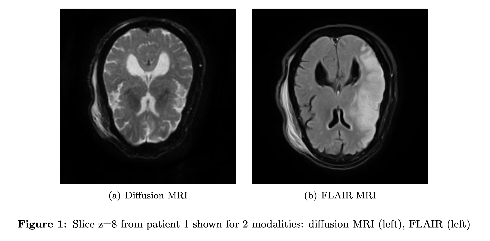
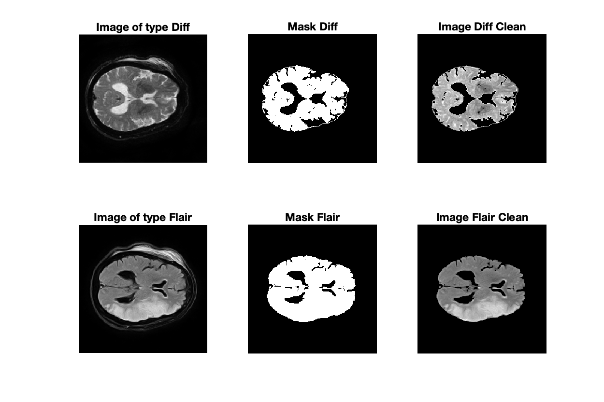

<h1 id="tutorial1" style="text-align: justify">Project 2: Registration of different MRI modalities</h1>

This project has been realised by Catalina Gonzalez Gomez, Sarah Dandou, Mélanie Savarin and Maxime Vincent as part of  the course of Image processing and analysis in INSA Lyon. 

<h1 id="tutorial1" style="text-align: justify">Introduction</h1>
    

Image registration consists in aligning two images that are initially shifted. It is one of the two major issues in the field of image processing, with segmentation.

The mapping is done by searching for geometric transformations (translations, rotation, etc) to move from one image to another. One of the images is considered as reference, it is the fixed image. We apply to the other, the _movinf_ image, a succession of geometric transformations. At each transformation, the alignment between the fixed and mobile images is calculated according to a pixel-to-pixel comparison criterion previously defined. We then preserve the $\rho$ transformation which allowed the best alignment: the moving image, once transformed, is called the registrated
image.

<h1 id="tutorial1" style="text-align: justify">Table of contents</h1>
    

* [Preprocessing](#part1)

    * [Rescale images](#subpart1.1)
    * [Remove the skull](#subpart1.2)
    
    
* [Rigid registration](#part2)

    * [Convert to grayscale images](#subpart2.1)
    * [Find initial translations $t_x$ and $t_y$](#subpart2.2)
    * [Input lower and upper bounds and steps for transformations](#subpart2.3)
    * [Apply transformations and calculate similarity criterion](#subpart2.4)
    * [Test of the rigid registration](#subpart2.5)
    * [Comments](#subpart2.6)
    

* [Point set registration](#part3)

* [Non-rigid registration](#part4)

* [Additional similarity metric](#part5)

<h1 id="tutorial1" style="text-align: justify">Introduction</h1>
    

We have at our disposal 2 images (Diffusion MRI and FLAIR MRI) from 3 patients with stroke. The MRI-FLAIR was systematically performed 6 days after the Diffusion MRI, which means that the patient do not have exactly the same position in the 2 images.
The objective of this project is to register the Diffusion MRI at best on the FLAIR MRI. Thus, the FLAIR image is the fixed image, and the Diffusion MRI is the moving image to be registered.

<h1 id="tutorial1" style="text-align: justify">1. Pre-processing</h1>

    
All pre-processing objectives are carried out thanks to the file `preprocessing.m` which call `rescaleIm.m` and `filter_IRM.m` files.

<h2 id="tutorial1" style="text-align: justify">1.1 Rescale images</h2>

Sometimes, the two images do not have the same **size**. We start by reducing the size of the largest image to the size of the smallest. The file `rescaleIm.m` takes the two images as inputs and returns the two same-sized images.

<h2 id="tutorial1" style="text-align: justify">1.2 Remove the skull</h2>

As we can see on the picture below, the skull appears on the original image (on the left). We want to keep only the **brain**. We start by tresholding the image and fetch the biggest blob that is supposed to be the brain. Then we create a **"mask"** (in the middle) and apply this mask in the original image to keep only pixels of the brain (on the right). The processing is different between an image of type flair or diffusion. The ventricules are indeed white on an diffusion MRI and black on an FLAIR MRI. The file `filter_IRM.m` takes an image and its nature (diffusion or flair) to filter the image and only keep the brain.

    

<h1 id="tutorial1" style="text-align: justify">2. Rigid registration</h1>

    
The point of this part is to register the Diffusion MRI at best on the FLAIR MRI with rigid registration.

Rigid registration offers $\rho$ transformations limited to $t$ translations and $r$ rotations. The FLAIR modality corresponds to the fixed image. The Diffusion modality is therefore the moving image. We apply to it rotations and translations with different parameters, and calculate each time the similarity of this image with the fixed image.
    

<h2 id="tutorial1" style="text-align: justify">2.1 Convert to grayscale images</h2>

First, we grayscale the images: the range of the cleaned images is **not always between 0 and 255** so we have to **scale** them on the same range to compare them. We do this step with the file `grayscaleIm.m`, which takes the cleaned image as input (without the skull) and returns the image with intensity between 0 and 255.
    

<h2 id="tutorial1" style="text-align: justify">2.2 Find initial translations $t_x$ and $t_y$</h2>

   
We start by calculating an initial estimate of the 2 necessary translations (a $t_x$ translation on the x-axis and a $t_y$ translation on the y-axis) between the two images. To do this, we calculate the center of gravity (centroid) of each image with the file `findCentroid.m`, which takes the mask of the image as input and returns the two coordinates of the centroid. We use the image's mask to give the same weight to all non-zeros pixels of the image. The mask was created in the subpart 1.2 to remove the skull so it is still available.
    
Once both centroids are calculated, we calculate the 2 translations ($t_x$ et $t_y$) between the 2 points. They will correspond to the initial translations $t_x0$ et $t_y0$. The initial rotation $r_0$ will be a zero rotation.
    

<h2 class="anchor" id="subpart2.3" style="text-align: justify">2.3 Input lower and upper bounds and steps for transformations</h2>

    
Then, we propose to the user to choose the **lower/upper bounds** and **steps** for the applied transformations with `askUserValue.m`. The user has to enter 6 values ($t_{min}$, $t_{max}$, $t_{step}$, $r_{min}$, $r_{max}$ and $r_{step}$). The interval has to be not too big to not explode in terms of computation time!
    

<h2 class="anchor" id="subpart2.4" style="text-align: justify">2.4 Apply transformations and calculate similarity criterion</h2>

    
Finally, we create a triple loop that applies translations between $t_{min}$ and $t_{max}$ with a $t_{step}$ step, same for rotations.

For each transformation $\rho_i = (t_x, t_y, r)$, we evaluate the quality of this transformation by computing the **similarity criterion** with `simcrit.m`. We store the set of parameters $\rho_i$ that gives the best (lowest) **similarity criterion**.
    

<h2 class="anchor" id="subpart2.5" style="text-align: justify">2.5 Test of the rigid registration</h2>

   
All of the rigid registration steps can be performed by calling the file `rigid_registration.m`.

__TODO : show outputs__
    

<h2 class="anchor" id="subpart2.6" style="text-align: justify">2.6 Comments</h2>

    

<h1 id="tutorial1" style="text-align: justify">3. Point set registration</h1>

<h1 id="tutorial1" style="text-align: justify">4. Non-rigid registration</h1>

<h1 id="tutorial1" style="text-align: justify">5. Additional similarity metric</h1>

