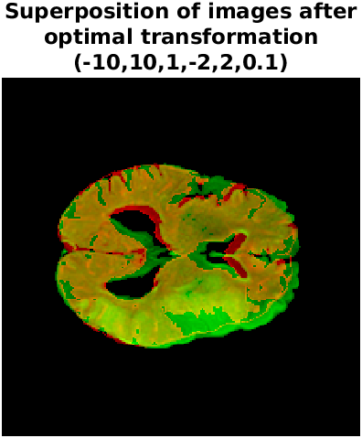

<h1 id="tutorial1" style="text-align: justify">Project 2: Registration of different MRI modalities</h1>

This project has been realised by Catalina Gonzalez Gomez, Sarah Dandou, Mélanie Sawaryn and Maxime Vincent as part of  the course of Image processing and analysis in INSA Lyon. 

<h1 style="text-align: justify">Introduction</h1>
    

    
Image registration consists in aligning two images that are initially shifted. It is one of the two major issues in the field of image processing, with segmentation.

The mapping is done by searching for geometric transformations (translations, rotation, etc) to move from one image to another. One of the images is considered as reference, it is the fixed image. We apply to the other, the moving image, a succession of geometric transformations. At each transformation, the alignment between the fixed and mobile images is calculated according to a pixel-to-pixel comparison criterion previously defined. We then preserve the $\rho$ transformation which allowed the best alignment: the moving image, once transformed, is called the registrated
image.

<h1 style="text-align: justify">Images available</h1>
    

We have at our disposal 2 images (Diffusion MRI and FLAIR MRI) from 3 patients with stroke. The FLAIR MRI was systematically performed 6 days after the Diffusion MRI, which means that the patient do not have exactly the same position in the 2 images.
The objective of this project is to register the Diffusion MRI at best on the FLAIR MRI. Thus, the FLAIR image is the fixed image, and the Diffusion MRI is the moving image to be registered.

<h1 id="tutorial1" style="text-align: justify">Table of contents</h1>
    

* [Preprocessing](#part1)

    * [Rescale images](#subpart1.1)
    * [Remove the skull](#subpart1.2)
    
    
* [Rigid registration](#part2)

    * [Convert to grayscale images](#subpart2.1)
    * [Find initial translations $t_x$ and $t_y$](#subpart2.2)
    * [Input lower and upper bounds and steps for transformations](#subpart2.3)
    * [Apply transformations and calculate similarity criterion](#subpart2.4)
    * [Test of the rigid registration](#subpart2.5)
    * [Comments](#subpart2.6)
    

* [Point set registration](#part3)
    * [Select the specific pixels in each image modality](#subpart3.1)
    * [Implement the point set registration](#subpart3.2)

* [Non-rigid registration](#part4)

* [Additional similarity metric](#part5)

<h1 class="anchor" id="part1" style="text-align: justify">1. Pre-processing</h1>

    
All preprocessing objectives are carried out thanks to the file `preprocessing.m` which call `rescaleIm.m` and `filter_IRM.m` files.

<h2 class="anchor" id="subpart1.1" style="text-align: justify">1.1 Rescale images</h2>

Sometimes, the two images do not have the same **size**. We start by reducing the size of the largest image to the size of the smallest. The file `rescaleIm.m` takes the two images as inputs and returns the two same-sized images.

<h2 class="anchor" id="subpart1.2" style="text-align: justify">1.2 Remove the skull</h2>

As we can see on the picture below, the skull appears on the original image (on the left). We want to keep only the **brain**. We start by tresholding the image and fetch the biggest blob that is supposed to be the brain. Then we create a **"mask"** (in the middle) and apply this mask in the original image to keep only pixels of the brain (on the right). The processing is different between an image of type flair or diffusion. The ventricules are indeed white on an diffusion MRI and black on an FLAIR MRI. The file `filter_IRM.m` takes an image and its nature (diffusion or flair) to filter the image and only keep the brain.

    

<h1 class="anchor" id="part2" style="text-align: justify">2. Rigid registration</h1>

    
The point of this part is to register the Diffusion MRI at best on the FLAIR MRI with rigid registration.

Rigid registration offers $\rho$ transformations limited to $t$ translations and $r$ rotations. The FLAIR modality corresponds to the fixed image. The Diffusion modality is therefore the moving image. We apply to it rotations and translations with different parameters, and calculate each time the similarity of this image with the fixed image.
    

<h2 class="anchor" id="subpart2.1" style="text-align: justify">2.1 Convert to grayscale images</h2>

First, we grayscale the images: the range of the cleaned images is **not always between 0 and 255** so we have to **scale** them on the same range to compare them. We do this step with the file `grayscaleIm.m`, which takes the cleaned image (without the skull) as input and returns the image with intensity between 0 and 255.
    

<h2 class="anchor" id="subpart2.2" style="text-align: justify">2.2 Find initial translations $t_x$ and $t_y$</h2>

   
We start by calculating an initial estimate of the 2 necessary translations (a $t_x$ translation on the x-axis and a $t_y$ translation on the y-axis) between the two images. To do this, we calculate the center of gravity (centroid) of each image with the function `findCentroid.m`, which takes the mask of the image as input and returns the two coordinates of the centroid. We use the image's mask to give the same weight to all non-zeros pixels of the image. The mask was created in the subpart 1.2 to remove the skull so it is still available.
    
Once both centroids are calculated, we calculate the 2 translations ($t_x$ et $t_y$) between the 2 points. They will correspond to the initial translations $t_{x0}$ et $t_{y0}$. The initial rotation $r_0$ will be a zero rotation.
    

<h2 class="anchor" id="subpart2.3" style="text-align: justify">2.3 Input lower and upper bounds and steps for transformations</h2>

    
Then, we propose to the user to choose the **lower/upper bounds** and **steps** for the applied transformations with `askUserValue.m`. The user has to enter 6 values ($t_{min}$, $t_{max}$, $t_{step}$, $r_{min}$, $r_{max}$ and $r_{step}$). The interval has to be not too big to not explode in terms of computation time!
    

<h2 class="anchor" id="subpart2.4" style="text-align: justify">2.4 Apply transformations and calculate similarity criterion</h2>

    
Finally, we create a triple loop that applies translations between $t_{min}$ and $t_{max}$ with a $t_{step}$ step, same for rotations.

For each transformation $\rho_i = (t_x, t_y, r)$, we evaluate the quality of this transformation by computing the **similarity criterion** with `simcrit.m`. We store the set of parameters $\rho_i$ that gives the best (lowest) **similarity criterion**. This criterion corresponds to the squared difference between the intensity of each pixel from the fixed image and its corresponding pixel from the moving image :

$$
\begin{equation*}
s = \sum_{i,j} (fixe[i,j] - mobile[i,j])^2
\end{equation*}
$$
    

<h2 class="anchor" id="subpart2.5" style="text-align: justify">2.5 Test of the rigid registration</h2>

   
All of the rigid registration steps can be performed by calling the function `rigid_registration.m`.

Before the registration, we can see the two images superposed on the image below. In green, we can see the FLAIR MRI and the Diffusion MRI in red. 
    

    
    
     

   

<h2 class="anchor" id="subpart2.6" style="text-align: justify">2.6 Comments</h2>

The rigid registration seems effective in this case because we are able to align both images even if it is not perfect. On one hand, the data we had has a good quality, but if the images were too noisy, the registration would probably fail because the optimization of the similarity criterion would be biased. 

On the other hand, the implementation we did supposed that the Diffusion MRI and FLAIR MRI have the same number of slices and that they are aligned, for example the 8th image of the Diffusion MRI correspond to the 8th image of the FLAIR MRI. If this last criteria is not guaranteed, the quality of the results could be affected because the method wouldn't find a good similarity between the images that are compared. 

Finally, if the range of the transformation is to small we can't get a good alignment between the two images and if it is too big the computation time explodes. A good way to improve the fact that the computation time explodes is to reduce the number of points we use to optimize the similarity criterion. The following method is based on this type of registration.

<h1 class="anchor" id="part3" style="text-align: justify">3. Point set registration</h1>

We implemented a variant of the rigid registration, which requires more interaction with the user. It still corresponds to a rigid registration (translations on x and y-axis and rotation), but the point set registration try to align specific pixels that had been previously selected by the user in both images.

<h2 class="anchor" id="subpart3.1" style="text-align: justify">3.1 Select the specific pixels in each image modality</h2>

    
We adapt the function `readPoints.m` from https://github.com/leonpalafox/planet_utils/blob/master/Matlab/readPoints.m
and created our own version (`readPoints.m`) in order to enable the user to select a set of points from which the alignment between the two images will be done. In this approach, we suppose that the selected points by the user are optimized and that he knows exactly what he wants to be aligned in order to have a better result.

Here we show an example of implementation. The selected points are far from being optimal, the point is to present the outputs of the implemented functions.

<h2 class="anchor" id="subpart3.2" style="text-align: justify">3.2 Implement the point set registration</h2>

Like the rigid registration, we propose to the user to choose the **lower/upper bounds** and **steps** for the applied transformations with `askUserValue.m`. The user has to enter 6 values ($t_{min}$, $t_{max}$, $t_{step}$, $r_{min}$, $r_{max}$ and $r_{step}$). The interval has to be not too big to not explode in terms of computation time!
    
Thanks to a triple loop, we tested all the possible transformations and we evaluate the quality of each one by computing the **similarity criterion** only between the set of points chosen by the user, thanks to the function `simcrit_set_points_registration.m`. We store the set of parameters $\rho_i$ that gives the best (lowest) **similarity criterion**. The function returns the best **similarity criterion**, the optimum transformation parameters and the transformed image. During the implementation, we set the Diffusion MRI as the moving image and FLAIR MRI as the fixed one.

The set point registration can be performed by calling the function `point_set_registration.m`. This implementation of the rigid registration is faster than the one tested before because the optimization is done only on a few points. But it is less robust because it highly depends on the points selected, the performance is up to the user ability to select enough and relevant points. 

<h1 class="anchor" id="part4" style="text-align: justify">4. Non-rigid registration</h1>

    
In addition to the methods explained above, it is possible to perform other transformations on the image, not only rotations and translations. It is thus proposed to use the `imregister` function of MATLAB to carry out these other transformations.
    
It is thus possible to use the function from `non_rigid_registration.m`, thus obtaining the optimal transformation.
    

Since this manipulation uses the MATLAB function, the user has less impact on the result. He simply enters the images and the transformations are found after a certain number of iterations.
    

<h1 class="anchor" id="part5" style="text-align: justify">5. Additional similarity metric</h1>

    
In section 2, we used a similarity criterion which is the **squared difference** between the intensity of each pixel from the fixed image (flair) and its corresponding pixel from the moving image (diffusion). The problem with this metric is that we can have a huge value of similarity criterion between two images, even if they are well registered. This could happen if the two images have a **different luminance**.
    
In this section, we tried another similarity metric: the **mutual information**. Unlike the least squares metric used previously, it does not correspond to the difference between pixel values. The mutual information of two grayscale images measures how much an $i$ value from a grayscale image 1 is **correlated** with another $j$ value from a second grayscale image 2. For example, with $i = 180$ and $j = 212$, we will say that these values are highly correlated if a large number of pixels are worth $180$ in the image 1 and $212$ in the image 2. The mutual image information calculates these values for each gray level combination ($i = 0...255$ and $j = 0...255$ for 8-bit images). Two images will have a strong similarity if many $i$, $j$ pairs have a strong correlation.
    
In other words, it is not necessary according to this criterion that two images have the same pixel values, it is enough that for a given pixel value $i$ in image 1, the corresponding pixels in image 2 have for the most part the same value $j$ (with $i$ not necessarily equal to/nor close to $j$). This criterion is **particularly useful for multi-modal images where structures correspond without having the same intensity**.
    
With the mutual information, we are theorically expecting better results than the squared difference because it is more generalisable.  

With our data, the difference on the quality of the results is not obvious.
   

